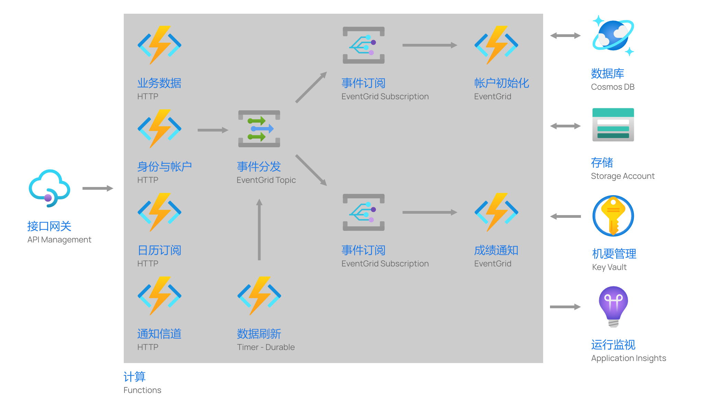

# UCQU 后端部署
本文档介绍如何部署 UCQU 后端服务。

## 准备
本服务基于 [Microsoft Azure](https://azure.microsoft.com) 开发运营。正式部署前，请确保拥有有效的 Azure 订阅。

若希望使用命令行进行 Azure 资源的部署，则须安装 [Azure CLI](https://docs.microsoft.com/en-us/cli/azure/) 或 [Azure PowerShell](https://docs.microsoft.com/en-us/powershell/azure).

生成后端项目需要 .NET Core 3.1 SDK. 该工具包可随最新版本的 Visual Studio 获得，也可以[单独获取](https://dot.net)。

生成与部署还需要 Azure Functions SDK 及相关的工具包。其配置方法随生成工具略有不同，详请参见[文档](https://docs.microsoft.com/en-us/azure/azure-functions/functions-develop-local)。

## 标准部署
下图展示 UCQU 后端服务在实际运营中的部署情况。

## 部署 Azure 资源
在本项目 `deploy` 目录中提供了部署 Azure 资源可用的 ARM 模板。注意该模板不包含标准部署中的 API 管理服务，你可以修改模板包括这一服务，或在部署后自行添加。模板的其它配置与标准部署一致。

使用 [Azure CLI](https://docs.microsoft.com/en-us/azure/azure-resource-manager/templates/deploy-cli) 或 [Azure PowerShell](https://docs.microsoft.com/en-us/azure/azure-resource-manager/templates/deploy-powershell) 启动部署，或点击下方按钮通过管理门户部署。

ARM 模板中各项参数意义如下：
- `cosmosDatabase`  
    存储数据的 Cosmos DB 数据库名称。注意本项不是数据库帐户名称。
- `cosmosContainer`  
    存储数据的 Cosmos DB 容器名称。
- `cosmosUseFreeTier`  
    是否对新创建的数据库帐户使用[免费优惠](https://docs.microsoft.com/en-us/azure/cosmos-db/optimize-dev-test#azure-cosmos-db-free-tier)。注意一个订阅只能有一个免费优惠帐户。
- `cosmosThroughput`  
    新建 Cosmos DB 数据库的预备吞吐量。数据库中的各容器将共享该容量。该值必须大于等于 400.
- `credentialKey`  
    用于加密用户凭据的 AES 密钥。使用 Base64 编码。
- `tokenIssuer`  
    服务发放的 JWT 令牌中的 `iss` 与 `aud` 字段。
- `tokenSigningKey`  
    用于为服务发放的 JWT 令牌签名的 SHA-256 密钥。使用 Base64 编码。
- `notificationWindowsPackageSid`  
    Windows UWP 客户端在应用商店中注册的包 SID. 用于推送通知。
- `notificationWindowsSecret`  
    Windows UWP 客户端的 WNS 密钥。用于推送通知。
- `serviceBaseAddress`  
    服务的基本 URI. 包括协议名，不要在末尾添加斜线。用于生成日历订阅地址。
- `termId`  
    当前学期的编号。格式为 `YYYYT`. `YYYY` 为当前学期所处学年的开始自然年。当前学期为第一学期时，`T` 取 `0`, 为第二学期时，`T` 取 `1`.
- `termStartDate`  
    当前学期的开始日期的 0 时。使用 ISO 8601 格式。
- `termStartDate`  
    当前学期随后寒暑假的开始日期的 0 时。使用 ISO 8601 格式。注意这一天不在当前学期内。

该服务部署的资源如下。有关这些资源的定价信息，请参见[文档](https://azure.com/pricing)。
- Storage Account  
    通用 v2, 标准 LRS, 热访问
- Cosmos DB Account  
    单区域读写，含数据库与容器各 1 个
- Apps Service Plan  
    消耗方案
- Function App  
    消耗方案
- Application Insight  
    无采样
- Event Grid Topic  
    含主题订阅 2 个
- Key Vault  
    标准，含机要 7 个

## 生成并部署应用程序
使用你选择的工具生成并部署 `DL444.Ucqu.Backend` 项目。详请参见[文档](https://docs.microsoft.com/en-us/azure/azure-functions/functions-develop-local)。

当使用 Visual Studio Code 生成后端服务的发布版本时，将针对 `win-x86` 目标环境进行[预编译优化](https://docs.microsoft.com/en-us/dotnet/core/deploying/ready-to-run)，以降低函数计算的冷启动时间。如果你属于以下任意一种情况，请更改预编译配置或禁用预编译。
- 部署目标不是 32 位 Windows 环境。
- 生成用计算机不是 Windows 环境。

要更改预编译配置，编辑项目中 `.vscode` 下的 `tasks.json` 文件，更改其中 `publish` 任务的命令行参数。参数详请参见[文档](https://docs.microsoft.com/en-us/dotnet/core/tools/dotnet-publish)。  

更改预编译配置会导致生成输出目录发生改变。因此还需要编辑 `.vscode` 下的 `settings.json` 文件中的 `azureFunctions.deploySubpath` 项，以反映输出目录的变化。
